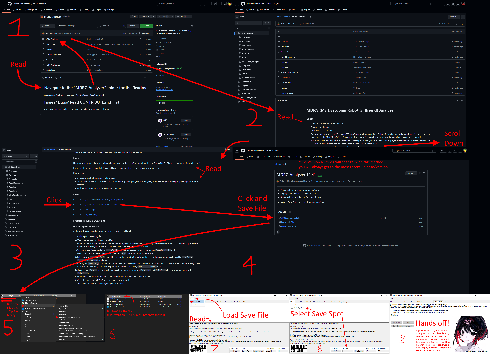

# MDRG (My Dystopian Robot Girlfriend) Analyzer

### Usage

1. Extract the Application from the Archive
2. Open the Application
3. Click "File" -> "Load File"
4. The saves are now stored in "C:\Users\USER\AppData\LocalLow\IncontinentCell\My Dystopian Robot Girlfriend\Saves". You can also export your saves in the Main Menu's "Load" menu, but if you use this, you will have to import the saves in the same menu yourself.
5. In the "Info" Tab, select your Save Game Slot Number (Select a File, its Save Slot will be displayed at the bottom (This is important!).) You will know it worked when it tells you the Game Version at the Bottom-Right.
6. Done. You may now check through the other tabs to find your game info.

### Linux

Linux is **not** supported, however, it is confirmed to work using "PlayOnLinux with 64bit" on Pop_OS 22.04 (Thanks to bgrmystr2 for testing this!)

If you use Linux, any technical difficulties will **not** be supported, and I cannot give any support for it.

Known issues:
- It may not work with Pop_OS' built-in Wine.
- The Debug tab may use up a lot of resources, and depending on your save size, may cause the program to stop responding until it finishes loading.
- Resizing the program may mess up labels and more.

### Links
[Click here to get to the GitHub repository of the program.](https://github.com/Wehrmachtserdbeere/MDRG-Analyzer)

[Click here to get the latest version of the program.](https://github.com/Wehrmachtserdbeere/MDRG-Analyzer/releases/latest)

[Click here to report bugs.](https://github.com/Wehrmachtserdbeere/MDRG-Analyzer/issues)

[Click here to suggest things.](https://github.com/Wehrmachtserdbeere/MDRG-Analyzer/discussions/categories/ideas)

### Frequently Asked Questions

#### How do I open an Autosave?

Right now, it's not natively supported. However, you can still do it:

1. Backup your save.mdrg file
2. Open your save.mdrg file in a File Editor
3. Observe: The structure follows a JSON file format, if you have worked with it, you might already know what to do, and can skip a few steps. If the file is in a single line, use a "JSON Beautifyer" to make it easier to work with.
4. Your saves are stored inside the `"saves": []` part. Your autosaves are stored inside the `"autoSaves": []` part.
5. Every save is encompassed by two curly brackets: `{ }`. This is important to remember!
6. Select in your `"autoSaves": []` one of the saves. This includes the curly brackets. For reference, a save has things like `"slot": 0,`, `"_time": 12345678900,`, and more.
7. Inside your `"saves": []` part, after the other saves, add a new line and paste your clipboard. You will know it worked if it looks very similar to the other saves, only with the exception of your new save having `"notes": "AutoSave"` in it.
8. Change your `"slot":` to a free slot. Example: If the previous saves are `"slot": 0,` and `"slot": 1,`, then in your new save, write `"slot": 2,`.
9. Make sure it works. Start the game, and load the slot. You should be able to load it.
10. Close the game, open MDRG Analyzer, and choose your slot.
11. You should now be able to view/edit your Autosave.

#### "Rent in" is empty! / Weekday is "Unknown"!

You saved either too early into your game, or you managed to save at a point where the variable for when rent is due is empty. Try saving at a later point. If it's still empty, please contact me on the MDRG Discord or open a GitHub Issue with your save file attached.

#### Bot name is empty! / Player name is empty

You saved too early into your game. Please wait until you have given your bot her name, and have given yourself a name.

**Save Editing when this is the case will create bugs that neither I nor Sheep will help you with!** If you still save edit when you haven't named your bot or yourself, you will take all the risks, and agree not to ask for help with that specific save!

#### How do I edit my save?

Follow these detailed, step-by-step instructions to edit your save file. Make sure you follow each step carefully.

##### Step 1: Load the Save into MDRG Analyzer

Before you start, make sure you have MDRG Analyzer installed on your computer. MDRG Analyzer is a tool that lets you edit save files for "My Dystopian Robot Girlfriend." If you don't have it installed, you need to download and install it first.

1. **Open MDRG Analyzer**

 Locate the MDRG Analyzer program on your computer. You can find it by checking your download location and double-clicking on it after unzipping it. For information on how to unzip the file, refer to [this Microsoft guide](https://support.microsoft.com/en-us/windows/zip-and-unzip-files-8d28fa72-f2f9-712f-67df-f80cf89fd4e5).

2. **Click on "File" at the Top Left of the Program Window**

 Once MDRG Analyzer is open, look at the top left corner of the program window. You should see a menu that says "File." Click on it.

3. **Click on "Load File" in the drop-down menu**

 After clicking "File," a drop-down menu will appear. Look for the option that says "Load File" and click on it.

4. **Navigate to Your Save File Location**

 A window will pop up asking you to select a file. You need to go to the folder where you saved your save files. The default location for this is:
 `C:\Users\YourUsername\Documents`
 - **C:** is the drive where your system files are stored (usually the main drive).
 - **Users** is the folder that contains all user accounts on your computer.
 - **YourUsername** is your account name on the computer. Replace it with your actual username.
 - **Documents** is a basic folder that stores your documents.

Alternatively, it is stored simply in: `Documents`, which is located under `This PC`. When accessed this way, your File Explorer address bar will simply say `Documents` instead of the path above.

If you are confused why the program might open in a weirdly different folder by default, it used to open in the previous default save file location.

**Do not use saves that are stored inside `C:\Users\Strawb\AppData\LocalLow\IncontinentCell\My Dystopian Robot Girlfriend\Saves`!**
In version 0.90 and after, this is used exclusively for in-game saves, that are **not** usable by **MDRG Analyzer**.

5. **Select Your Save File and Press "Open"**

 Once you are inside the folder, you will see your save file. They might be named something like "save1234567890" or "save123456789.mdrg". Click on the save file you want to edit and then click the "Open" button.

6. **Select the Correct Save Slot**

 After loading the save, you'll see some information about it in the program. Look for the "Info" Menu, which is near the top-left side of the program.
 - You will see several radio buttons (little circles you can select). These correspond to different save slots.
 - Select the radio button for the save slot you want to edit.
 - Double-check that you have selected the correct slot by looking at the "Save Slot" display at the bottom-right of the program window. It should show the slot number you selected in some tabs.

##### Step 2: Activate Save Editing

Now that your save file is loaded, you need to activate the editing mode.

1. **Navigate to the "Save Editing" Tab**

 Look at the tabs near the top of the program window. Find and click on the tab labeled "Save Editing."

2. **Check the "I acknowledge and understand [...]" Checkbox**

 You will see a warning message and a checkbox next to it. This is a safety feature to ensure you understand that editing save files can cause issues if not done correctly. Read the warning, then click the checkbox to acknowledge it.

3. **Press "Create Backup"**

 Before making any changes, it's highly recommended to create a backup of your save file.
 - Find the "Create Backup" button and click it.
 - This will create a copy of your current save file, so if something goes wrong, you can easily restore it.

4. **Change the Values You Want to Edit**

 Now you can change the values in your save file. Use the other tabs in the program to navigate to the specific sections you want to edit.
 - Click on the fields or values you want to change and type in the new values.
 - Be careful to only change values you understand, as incorrect edits can cause your save to malfunction.

##### Step 3: Save and Load the Edited File

After editing, you'll need to save your changes and load the edited file in the game.

1. **Navigate to the "Save Editing" Tab Again**

 Return to the "Save Editing" tab if you are not already there.

2. **Press the "Save (Overwrites current save!)" Button**

 Find the button labeled "Save (Overwrites current save!)" and click it. This will overwrite your existing save file with the edited version. Be careful, this action cannot be undone unless you created a backup.

3. **Start MDRG (My Dystopian Robot Girlfriend)**

 Now, open your game as you normally would.

4. **Press "Load Game"**

 From the main menu of the game, click on "Load Game."

5. **Press "From File" at the Bottom of the Popup**

 A popup will appear showing your save slots. At the bottom of this popup, look for and click the "From File" button. This allows you to load a new save file from your computer.

6. **Load Your Edited File**

 Navigate back to the save file you edited (it’s usually the same location you found it in:
 `C:\Users\YourUsername\AppData\LocalLow\IncontinentCell\My Dystopian Robot Girlfriend\Saves`). Select it and click "Open."

7. **Press "Load" on the Save Slot You Edited**

 Choose the save slot that corresponds to the file you just edited and press "Load."
 
8. **Check the Status of the Values You Changed**

 Once the save file is loaded, check to make sure that the changes you made have taken effect. Look at the stats, PC, or any other values you modified, they should now reflect the changes you entered.

That's it! You have successfully edited your save file. If something doesn’t look right, you can reload the backup file you created and try again.

##### Visual Guide

For a visual guide, refer to the following image:

##### Video Guide

There is now a detailed video guide to help you navigate the Save Editor for MDRG Analyzer. This video provides a live demonstration, showing you exactly how to use the editor step-by-step.

- **What It Is**: The video is a live recording that walks you through each step of using the Save Editor, from exporting your save file to editing and saving it.
- **Where to Find It**: You can download and watch the video by clicking [here](https://github.com/Wehrmachtserdbeere/MDRG-Analyzer/raw/master/MDRG%20Analyzer/MDRG_Analyzer_Save_Editing_Video_Guide.mp4).
- **How It Helps**: This visual guide is perfect if you prefer seeing the process in action rather than reading instructions. It will show you exactly what to click and where to go, making the editing process easier to understand.

Feel free to watch the video for a clearer understanding of how to edit your save files effectively.

#### I get an error when loading my save!

This could be a result of a corrupted save file. Make sure to use a JSON Beautifier and check if there is something inside the "savedata" part. As a quick check, if you meet a massive wall of text and symbols, you likely have proper save data. If there is not, your save might be corrupted. Re-export it and check again.

If this persists, go on the [Discord Server](https://discord.com/invite/SwpQUFWreW) and ask for assistance there.

If you get another error, report it either through the [Discord Server](https://discord.com/invite/SwpQUFWreW), or open an [Issue](https://github.com/Wehrmachtserdbeere/MDRG-Analyzer/issues).